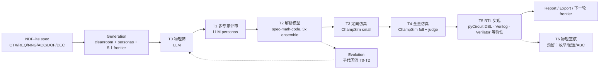

> 结论先行：pyCircuit **值得作为 submodule 接入**，它是这条链路里最难自造的一段。它提供 MLIR 硬件方言 + Python DSL 前端 + Verilog/C++ 双后端，`compiler/frontend/pycircuit/spec/dse.py` 的 `product()/grid()/filter()` 正好承接 NDF-lite 的 DOF 条款，`lib/cache.py` 是参数化结构级 cache，`designs/XiangShan-pyc/` 有完整乱序核（dcache/L2/TAGE BPU/ROB/rename）并已 check-in 生成好的 Verilog 与 66 个 `yosys_synth.ys`，可直接充当 Tier5 的基线 RTL 语料。

# 端到端补足：从问题定义到 RTL 验证（Tier6 预留）

## 目标链路

本次交付终点是 **Tier5（RTL 实现 + 等价性）**。Tier6 只做可扩展预留，不装 OpenROAD/sky130，不跑物理签核。

## 环境前提（本机已探明）

- Ubuntu 24.04 (WSL2)、6 核、**7 GB 内存（可用约 3 GB）**、878 GB 可用磁盘
- 已有：`verilator 5.020`、`iverilog 12.0`、`cmake`、`ninja`、`gcc/g++`
- 本次需要：`ChampSim`、LLVM/MLIR 19（仅有 17/18）、可选 `yosys`（仅用于 Tier5 LEC，apt 有 0.33）
- **本次不装**：OpenROAD、OpenSTA、sky130 PDK（留给 Tier6 实现时再做）
- **关键约束**：内存 7 GB 不足以源码编译 LLVM。必须走 `apt.llvm.org` 装 `llvm-19-dev / libmlir-19-dev / mlir-19-tools` 预编译包（pyCircuit CI 同款做法），再以 `ninja -j2` 链接 `pycc`。

---

## 阶段 0：护栏与「真实性语义」（其余阶段的前提）

没有这一层，后面接入的真实工具会被现有的 fallback 逻辑重新降级成假 PASS。

- 新增 `.github/workflows/ci.yml`：`uv sync --extra dev` → ruff → mypy（宽松）→ pytest，全程离线、不需要 `CURSOR_API_KEY`。
- [pyproject.toml](pyproject.toml) 增加 `[tool.ruff]` / `[tool.mypy]`，dev extra 补 `ruff`、`mypy`、`pytest-cov`。
- **引入证据等级**：`TierResult` 增加 `evidence: EvidenceLevel`（`stub | analytic | sim | rtl | signoff`）、并真正写入 `model_id`、`pool`、`prompt_hash`、`tool_versions`。`signoff` 枚举值现在就保留，供 Tier6 将来使用。见 [archzero/models.py](archzero/models.py)。
- **拆除三处假 PASS**：
  - [archzero/funnel/tier3.py](archzero/funnel/tier3.py) 的 `if sim.unavailable and ok:` → 改判 `UNAVAILABLE`。
  - [archzero/funnel/tier5.py](archzero/funnel/tier5.py) 的「documented gate + proxy OK 视为 pass」→ 删除。
  - [archzero/funnel/tier2.py](archzero/funnel/tier2.py) 的 `meets_target` 软覆盖 → 改为记录分歧并要求 ensemble 多数决。
  - 新增 `[funnel] strict_evidence = true`：T3 以上若配置了真实后端却不可用，一律 `UNAVAILABLE`，绝不 PASS。
- **Mock LLM 测试骨架**：`tests/conftest.py` 提供 `FakeLLM`（固定 JSON 的 record/replay），补齐 T0–T5 的门控单测；Tier6 仅测「调用后返回 UNAVAILABLE / Planned」。
- **Golden 套件**：`tests/golden/` 冻结 10 个候选与期望裁决（到 T5），CI 内断言容差。

## 阶段 1：真实架构仿真（ChampSim → Tier3/Tier4）

现状最严重的问题是：**真 ChampSim 跑通反而必然 fail**——适配器只回 `{returncode, stdout_tail}`，而闸门读的是 `sim.metrics["miss_reduction"]`（[archzero/sim/champsim.py](archzero/sim/champsim.py) 对 [archzero/funnel/tier3.py](archzero/funnel/tier3.py)）。

- `tools/setup_champsim.sh`：pin commit 克隆 + 构建 ChampSim。
- `benchmarks/`：`fetch_traces.py`（manifest 含 url + sha256 + size）、`suites.yaml` 定义 `small`/`full` 套件；让 [archzero/config.py](archzero/config.py) 里始终未被读取的 `traces_dir` 真正生效。
- **统一指标契约**：新增 `SimMetrics` pydantic 模型（`mpki / ipc / bw_delta_frac / miss_reduction / cycles / per_trace`），stub 与真实后端共用同一 schema，stub 强制标注 `evidence="stub"`。
- 重写 `champsim.py`：把 `sim_knobs.json` 映射为 ChampSim 配置（prefetcher 模块、cache 尺寸/关联度），跑 baseline 与 candidate，解析 `LLC LOAD MPKI` / `cumulative IPC` / DRAM 带宽，多 trace 取几何平均；baseline 结果按 (trace, config) 哈希缓存进 artifact store。
- 重写 `gem5.py`：解析 `stats.txt` 键值对，产出同一 schema。

## 阶段 2：RTL 实现层（pyCircuit submodule → Tier5）

- 加 submodule `vendor/pycircuit` → `https://github.com/lukebest/pyCircuit`（注意：上游**没有发布 wheel 也没有 release**，`pycircuit-hisi` 在 PyPI 上是 404，必须本地构建）。
- `tools/setup_pycircuit.sh`：`llvm.sh 19` 装预编译 MLIR → `bash flows/scripts/pyc build`（限 `-j2` 规避内存）→ 安装到 `.pycircuit_out/toolchain/install`；配置项 `[rtl] pycircuit_root / pyc_toolchain_root`。
- 新增 `archzero/rtl/`：
  - `backend.py`：`RtlBackend` ABC + `PyCircuitBackend.build()`，调用 `python -m pycircuit.cli build … --target both`，返回 `manifest.json` / `compile_stats.json` / verilog 列表。
  - `codegen.py`：Tier5 的 persona 改为产出 **pyCircuit DSL 模块**（`design.py` + `tb_design.py`）而非手写 Verilog，prompt 注入 `docs/FRONTEND_API.md` 与 `api_contract.py` 摘要，并用 `pycircuit.spec.dse.product()` 把 DOF 条款展开成参数变体。
  - `equivalence.py`：主闸门为 C++ 行为仿真 vs Verilator 的 commit-point trace 比对（对标上游 `flows/tools/linx_trace_diff.py`）；可选 yosys LEC（`equiv_*`）若本机已装则跑，未装则记 `tool_versions` 并跳过，**不因此假 PASS**。
- 重写 [archzero/funnel/tier5.py](archzero/funnel/tier5.py)：mechanism → DSL → 编译 → Verilator 回归 → 等价性裁决；工具缺失一律 `UNAVAILABLE`。
- 基线 RTL 直接复用 `vendor/pycircuit/designs/XiangShan-pyc/`（`coupled_l2`、`dcache`、`icache`、BPU），把 [specs/demo.md](specs/demo.md) 的 L2 预取问题映射到 `coupled_l2`。

## 阶段 3：Tier6 物理签核 — 仅预留（本次不实现）

不做安装、不跑 OpenROAD/sky130、不产真实 PPA。只留下后续可插拔的骨架：

- [archzero/models.py](archzero/models.py)：`Tier.T6 = "tier6"`；`EvidenceLevel.SIGNOFF` 已在阶段 0 保留。
- [archzero/config.py](archzero/config.py)：`FunnelQuotas.tier6_keep`（默认 2）；`[sign]` 配置节占位（`enabled = false`、`yosys_bin` / `openroad_bin` / `pdk` / `liberty` 可选字段）。
- `archzero/sign/` 包骨架：
  - `__init__.py`
  - `backend.py`：`SignBackend` ABC（`available() -> bool`、`run(req) -> SignResult`）+ `NullSignBackend`（恒 `available=False`）
  - `ppa.py`：`PPAMetrics` pydantic 模型（`area_um2, wns_ns, tns_ns, power_mw, cells, utilization`）
- `archzero/funnel/tier6.py`：`evaluate_tier6` 立即返回 `Verdict.UNAVAILABLE`，summary 标明 `"Tier6 signoff reserved; not implemented"`，不调用任何 EDA。
- [archzero/funnel/pipeline.py](archzero/funnel/pipeline.py)：`TIER_ORDER` / `TIER_FNS` 注册 T6；默认 `through` 仍为 T2，显式 `--through tier6` 时走到预留路径并得到 UNAVAILABLE。
- [archzero/doctor.py](archzero/doctor.py)：`sign` 检查显示 `planned / reserved`，不报 hard error。
- README 成熟度矩阵：Tier6 = **Planned（reserved）**。

后续实现时只需填充 `SignBackend` 实现与 `tools/setup_eda.sh`，不必再改漏斗骨架。

## 阶段 4：闭环编排与工程化

- **断点续跑**：`archzero run --resume <campaign_id>`；campaign 状态机 `running/paused/done/failed`；从 DB 重载候选；修正 [archzero/funnel/pipeline.py](archzero/funnel/pipeline.py) 中 `passed_through()` 只认 `PASS` 而剪枝却认 `UNAVAILABLE` 的不一致。
- **演化回流**：MAP-Elites 子代重新进入 T0–T2（`--reenter-through`），廉价评估改用 [archzero/analytic/core.py](archzero/analytic/core.py) 而非 stub-only；记录 `parent_id` 血缘。vendor 真实 OpenEvolve 并让适配器跑真实循环。
- **frontier 自动轮次**：`run --expand-frontier --auto-round N`，让 §5.1 扩展出的问题包真正回到漏斗跑下一轮。
- **预算对等**：Cursor 池加上限（现在 `BudgetGuard.allow()` 对 CURSOR 恒返回 True）；降级事件写入 TierResult；新增 `--max-tokens`。
- **可复现 bundle**：[archzero/export_bundle.py](archzero/export_bundle.py) 补 config 快照、`uv.lock`、git SHA、model catalog、各工具版本（verilator/champsim/pycc；yosys/openroad 若存在则记录）、每 tier 的 `model_id`；新增 `archzero reproduce`。
- **安全**：Tier2 生成的 `model.py` 从主进程 `runpy` 改为子进程执行 + 超时 + `setrlimit` 资源上限 + 无网络。
- **存储**：SQLite 开 WAL 与 `busy_timeout`，加 `schema_version` 迁移表。
- **观测**：结构化 JSON 日志（campaign/candidate/tier/duration/status）；[archzero/doctor.py](archzero/doctor.py) 扩展检查 pycc、champsim、traces、可选 yosys；Web UI 展示证据等级徽章与工具版本，Tier6 显示 Planned。

## 阶段 5：文档与验收

- README 增加成熟度矩阵（每个 tier 标注 Implemented / Stub / Planned）与完整安装指南；Tier6 明确为 Planned（reserved）。
- 新增 `archzero e2e` 演示命令：一个候选从 spec 跑到 **Tier5**，产出完整 artifact 链；不要求签核工具。

## 明确不做（本次）

- **Tier6 物理签核执行路径**：不装 OpenROAD / sky130 / OpenSTA，不跑 floorplan/place/CTS/route/STA，不产真实 PPA 闸门结果。
- 部署遥测 / Feedback 闭环：`archzero/feedback/source.py` 保持 `NullFeedbackSource` 接口不实现，`next_questions.py` 继续作为离线替身。

## 风险

- **内存 7 GB 是最大风险**：pycc 链接可能 OOM，需限 `ninja -j2`。
- ChampSim trace 体积与可获取性不稳定，需要 checksum + 优雅跳过。
- 单候选跑完到 T5 可能需数十分钟；配额与并发要压住。
- Tier6 预留后，调用方若误开 `--through tier6` 只能得到 UNAVAILABLE——需在 CLI/help 与 doctor 中写清楚。

