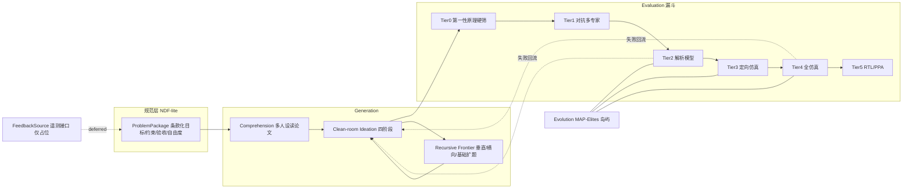

# ArchZero Idea Factory 实现计划

目标：做出论文 *Computer Architecture's AlphaZero Moment* 描述的产品形态，除 Feedback/遥测层只留接口外，其余全部实现。所有 LLM 流量经 Cursor SDK（Python `cursor-sdk`），可用账户目录内全部模型，并按用量池分流。

## 已确认的两个前提

- **Gauntlet submodule 保持只读**：只复用 `Gauntlet/personas/**/*.md` 与其 prompt 协议（三阶段 verify-repair、发散-收敛），评审/出题/量化流程在新引擎里用 Cursor SDK 重写。它现在把 Anthropic/Gemini 客户端硬编码在每个脚本里（`Gauntlet/main.py`、`Gauntlet/idea_generator.py`），没有统一封装，无法直接复用。
- **Tier 3/4 先做适配器 + 可跑替身后端**：`SimBackend` 接口 + 内置轻量 trace 模拟器，ChampSim / gem5 driver 写好但按配置启用，装上即插。

## 目标架构



## 仓库落点

新增 Python 包（uv + `pyproject.toml`，Python 3.11+，本机 3.14 可用）：

```
archzero/
  cli.py                 # archzero models|spec|read|ideate|run|evolve|report
  config.py              # TOML 配置 + 校验
  llm/  client.py catalog.py router.py budget.py transcript.py shim.py
  spec/ ndf.py lint.py templates/
  generation/ comprehension.py cleanroom.py frontier.py personas.py
  funnel/ pipeline.py tier0.py tier1.py tier2.py tier3.py tier4.py tier5.py taxonomy.py
  evolve/ backend.py mapelites.py openevolve_adapter.py
  sim/ backend.py stub.py champsim.py gem5.py
  store/ db.py artifacts.py
  feedback/ source.py     # 接口 + NotImplemented 占位
  report/ weekly.py templates/
tests/
```

产物与状态落在 `.archzero/`（gitignore）：`factory.db`（SQLite）、`artifacts/`（内容寻址）、`transcripts/`、`scratch/`。

## 关键设计决策

**1. LLM 通道与用量池路由**（`archzero/llm/`）

启动时 `Cursor.models.list()` 拉取账户目录，按池分类并落缓存：

- **池 1（Cursor Models，含量充裕）**：`composer-2.5`、`cursor-grok-4.5` — 承接全部高吞吐工作：Tier0 硬筛、进化变异与修复循环、人设扩写、解析模型 verify-repair 迭代。
- **池 2（Other Models，按 API 计价）**：`claude-*` / `gpt-*` / `gemini-*` — 只用于低频高价值节点：Tier1 合成裁决、规格生成、Tier4/5 终审。
- 池划分写在配置里可覆盖；目录里缺失的 ID 回落 `auto-smart` + `optimize_for`，再回落 `auto`。
- `budget.py` 累计 `run.usage`，按 campaign 设池 2 上限，超限拒绝升级并降级到池 1。

调用封装两种形态，统一用 `AsyncClient.launch_bridge` + `async with` 保证释放，`CursorAgentError`（没跑起来，尊重 `retry_after` 重试）与 `result.status == "error"`（跑了但失败，进失败taxonomy）严格分开：

```python
async def complete(self, persona: str, context: str, task: TaskClass) -> str:
    model = self.router.pick(task)          # 池感知
    async with await client.agents.create(
        model=model, api_key=self.api_key,
        local=LocalAgentOptions(cwd=self.scratch()),   # 每次调用独立 scratch
    ) as agent:
        run = await agent.send(f"{persona}\n\n---\n\n{context}")
        self.transcript.log(agent.agent_id, run.id, model)
        return await run.text()
```

`work()` 形态给需要真正写代码/跑命令的层（Tier2 建模、Tier3/4 建 harness、进化变异）：cwd 指向候选工作区，人设同时写成 `.cursor/rules/persona.mdc` 并开 `setting_sources=["project"]`。SDK 无顶层 system prompt 字段，人设一律以前缀 + rules 双写注入。

**2. 规范层 NDF-lite**（`archzero/spec/`）

问题包 = 带 frontmatter 的 markdown，条款有稳定 ID（`CTX-001` / `REQ-003` / `ACC-002` / `DOF-001`），字段含目标、非目标、PPA 与负载约束、验收判据、开放自由度、决策日志。`lint.py` 校验 ID 唯一性、`refines` 链接可达、验收判据可测。所有 Candidate 与失败记录引用条款 ID，保证归因不漂移。

**3. 生成层**

- `comprehension.py`：PDF → 多人设并行蒸馏 → 结构化洞察（瓶颈、假设、可攻击点），人设直接读 `Gauntlet/personas/reading_assistant/`。
- `cleanroom.py`：论文缺的 clean-room 四阶段——只读前 3 页抽 `[CONTEXT][SYMPTOM][CONSTRAINT]` → 解法脱敏 → N 次独立生成 → 对照全文判定（复现/等价/替代/缺陷）→ 产出开放问题集。
- `frontier.py`：垂直/横向/基础三向扩题，把开放问题回灌成新 ProblemPackage。

**4. 评估漏斗**（`archzero/funnel/`）

统一 `Candidate`（规格 + 代码路径 + metrics + clause refs + tier 历史），SQLite 存储支持漏斗吞吐统计与语义去重。每档是一个 `TierGate`：输入候选流、按配额输出、失败进 `taxonomy.py` 结构化回流生成端。

- Tier0 池 1 硬筛（守恒律/带宽上界/Amdahl 类硬约束），批量并发。
- Tier1 多人设对抗 + synthesizer 收敛（复用 Gauntlet 人设与发散-收敛协议）。
- Tier2 Text→Math→Code→Insight，产出可执行 `model.py` + Magic Gap 解释；共享解析核 `analytic/core.py` 供各候选扩方程。
- Tier3/4 经 `SimBackend` 跑：`stub.py` 是可跑替身（合成 trace + 轻量事件模拟），`champsim.py` / `gem5.py` 走同一接口，agent 负责生成仿真补丁并迭代修复。
- Tier5 按 agentic_circuit_optimizer 方法论做出口钩子：**提交点架构轨迹等价门**固定不漂移，PPA 由 Yosys/OpenSTA（若可用）或代理模型给出，否则标记 `unavailable` 不阻塞漏斗。

**5. 进化搜索**（`archzero/evolve/`）

`EvolutionBackend` 接口，两个实现：内置 `mapelites.py`（质量-多样性归档 + 岛屿迁移 + cascade 评估 + artifact 回灌 prompt，全部走 Cursor SDK）为默认；`openevolve_adapter.py` 把 OpenEvolve 作为 submodule 接入，通过 `llm/shim.py` 提供的 OpenAI 兼容 `/v1/chat/completions` 本地端点转发到 Cursor SDK，让它也只用 Cursor 模型。特征维用机制族、模型误差、仿真加速比、面积代理。

**6. 遥测（暂缓）**

`feedback/source.py` 定义 `FeedbackSource.collect() / calibrate() / drift_questions()` 接口并在 pipeline 里留调用点，实现体抛 `NotImplementedError`，README 标注为唯一未实现层。

## 运行前提

`CURSOR_API_KEY` 当前未设置，需要 `export CURSOR_API_KEY="cursor_..."`（Dashboard → Integrations）。Start 计划不含 SDK，需 Pro 及以上。首轮会先跑 `archzero models` 打印目录与池划分做自检。

## 验收

`archzero run --spec specs/demo.md --through tier2` 能端到端跑通：出题 → 生成 N 候选 → Tier0/1/2 过闸 → 写库 → `archzero report` 输出周级漏斗报告（进出量、淘汰率、失败模式分布、两个池的用量与花费）。Tier3/4 用 stub 后端跑通同样链路。